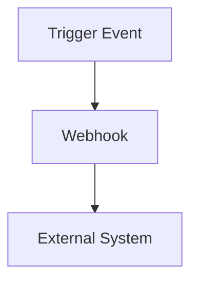

---
title: "Advanced Configuration"
---

## Overview

Customize your Documentation.AI experience with advanced settings.

<Callout kind="info">
Explore different configurations to enhance your documentation.
</Callout>

## Custom Templates

Create and use custom templates to standardize your documentation process.

- **Create Template**: Design your layout with reusable components.
- **Apply Template**: Consistently use across documents.

## Webhooks

Utilize webhooks to automate tasks and integrate with external systems.

## API Configuration

<ParamField query="debug" param-type="boolean" required="false">
  Enable debugging mode for API requests.
</ParamField>

<Steps>
  <Step title="Enable Debugging" icon="settings">
    Adjust API settings to enable debugging for troubleshooting.
  </Step>
</Steps>

## Resources

For a full list of configuration options, refer to our [Configuration Documentation](/configuration/docs).
